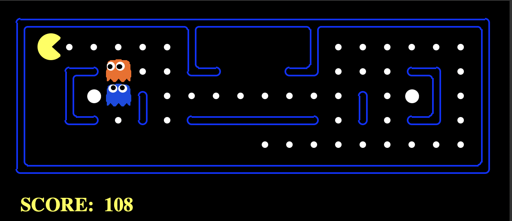

# AI Pacman 

A personal project exploring adversarial search techniques, specifically Minimax, Alpha-Beta Pruning, and Expectimax, in the context of building intelligent agents for the classic game of Pacman. This project demonstrates how agents can make strategic decisions in multi-agent environments with adversarial and probabilistic behaviors.

## Overview
The project implements various AI agents that control Pacman's behavior in a multi-agent environment, where Pacman competes against ghosts. Each agent uses different search techniques to maximize Pacman's survival and score. The approaches implemented include:
- **Reflex Agent**: A baseline agent that uses heuristics to make decisions based on immediate surroundings.
- **Minimax**: A decision-making algorithm designed for adversarial play, treating ghosts as fully rational opponents.
- **Alpha-Beta Pruning**: An optimized version of Minimax that reduces computation by ignoring branches of the search tree.
- **Expectimax**: An algorithm that models the probabilistic nature of ghost actions, assuming they do not always play optimally.
- **Evaluation Function**: A fine-tuned evaluation function that enhances Pacman’s strategy based on game dynamics.
  
## Project Structure
- **multiAgents.py**: Contains the implementation of each agent, including ReflexAgent, MinimaxAgent, AlphaBetaAgent, and ExpectimaxAgent.
- **pacman.py**: Runs Pacman games and manages the game state.
- **game.py**: Provides core game mechanics, defining types such as GameState, Agent, and Direction.
- **autograder.py**: Autogrades the agent implementations by running test cases.
- **graphicsDisplay.py**: Displays Pacman’s actions and game progression visually.
- **test_cases/**: A collection of test cases to verify agent behavior and performance.

## Results and Observations
The various agents demonstrate differing levels of effectiveness in Pacman, with the Expectimax and Alpha-Beta agents often achieving higher scores. The ExpectimaxAgent, in particular, performs well against random ghost movements, reflecting a robust decision-making ability under uncertainty.

## Future Enhancements
- Implement adaptive evaluation functions that learn from Pacman’s performance.
- Extend agents to handle larger and more complex game layouts.
- Integrate machine learning techniques to further improve Pacman's decision-making based on historical performance.

## Acknowledgments
This project was inspired by assignments from the University of Washington and UC Berkeley, providing a foundation for exploring search algorithms through the classic Pacman game.
